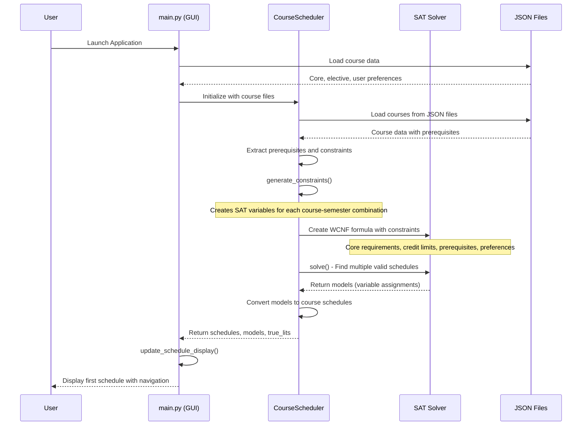
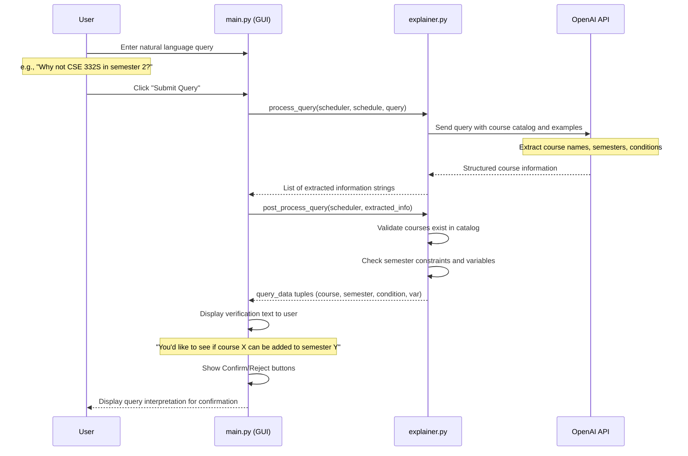
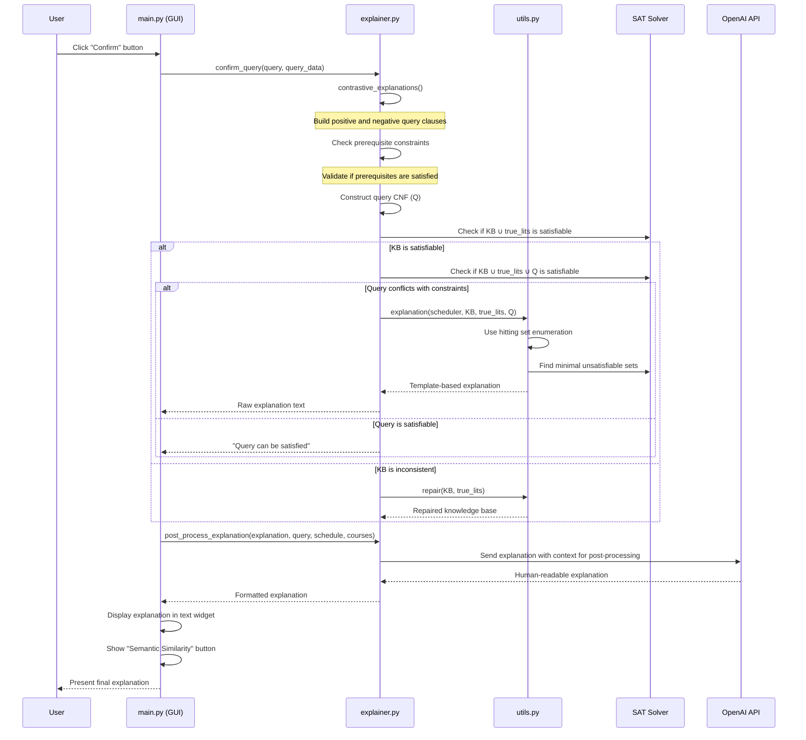
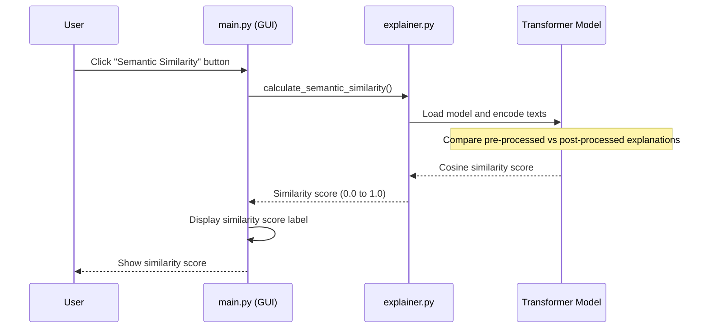

# TRACE-CS: Course Scheduling System with Contrastive Explanations

## System Overview

TRACE-CS is an intelligent course scheduling system that generates optimal course schedules for Computer Science students while providing contrastive explanations for scheduling decisions. The system uses SAT (Satisfiability) solving to generate schedules that satisfy degree requirements, prerequisites, credit constraints, and user preferences, then provides natural language explanations for why certain courses are or are not included in specific semesters.

## Architecture Components

1. **GUI Interface (main.py)** - tkinter-based user interface
2. **CourseScheduler (scheduler.py)** - SAT-based schedule generation
3. **Explainer (explainer.py)** - Natural language query processing and explanation generation
4. **Utilities (utils.py)** - SAT solving helpers and explanation mapping

## Process Flow Sequence Diagrams

### 1. System Initialization and Schedule Generation

### 2. User Query Processing and Verification

### 3. Contrastive Explanation Generation

### 4. Semantic Similarity Calculation

## Detailed Process Descriptions

### Schedule Generation Process

The system begins by loading course data from JSON files containing:

- Core CS courses with prerequisites
- Various elective categories (CS, science, social, methods, systems)
- User input (taken courses, preferences, current semester)

The `CourseScheduler` creates SAT variables for each course and semester combination, then generates constraints:

1. **Core Requirements**: All core CS courses must be scheduled
2. **Credit Constraints**: Each semester has min/max credit limits (9-15 credits)
3. **Category Requirements**: Specific credit requirements for each elective type
4. **Prerequisites**: Prerequisite courses must be taken before dependent courses
5. **Exclusivity**: Each course can only be scheduled once
6. **User Preferences**: Weighted soft constraints for preferred courses

The SAT solver finds multiple valid solutions, which are converted back to human-readable schedules.

### Query Processing and Explanation

When a user asks a contrastive question like "Why not course X in semester Y?", the system:

1. **Natural Language Processing**: Uses OpenAI GPT-4 to parse the query and extract:

   - Course names (with fuzzy matching to course catalog)
   - Target semesters
   - Positive/negative conditions (add vs remove)

2. **Query Validation**: Checks if:

   - Courses exist in the catalog
   - Semesters are valid and not in the past
   - Course hasn't already been taken

3. **User Verification**: Displays interpreted query for user confirmation

4. **Constraint Analysis**: Once confirmed, builds SAT clauses representing the query and checks satisfiability against the knowledge base

5. **Explanation Generation**: If the query conflicts with constraints, uses hitting set enumeration to find minimal explanations mapping to human-readable constraint templates

6. **Post-Processing**: Uses OpenAI to convert technical explanations into natural language, contextualizing with the specific query and schedule

### Key Technical Components

**SAT Encoding**:

- Variables: `c{i}` (course i scheduled), `c{i}_s{j}` (course i in semester j)
- Constraints encoded as CNF clauses with weighted soft constraints for preferences

**Explanation Engine**:

- Maps SAT clauses to human-readable constraint templates
- Uses minimal unsatisfiable set (MUS) computation for precise explanations
- Employs hitting set enumeration for finding alternative explanations

**Template System**:
The system maintains a mapping between SAT clauses and descriptive templates like:

- "Course X is a core requirement for CS"
- "Course X must be taken before semester Y because it is a prerequisite for course Z"
- "The total credits for semester Y should not exceed 15 credits"

This enables the system to provide meaningful explanations that directly relate to degree requirements and scheduling constraints rather than abstract logical formulas.

### Error Handling and Edge Cases

- **Invalid Queries**: System detects and reports malformed or impossible requests
- **Inconsistent Schedules**: Automatic repair mechanisms for conflicting constraints
- **Missing Prerequisites**: Specific explanations for prerequisite violations
- **Credit Overflows**: Clear messaging about credit limit constraints
- **Already Taken Courses**: Prevents scheduling of completed courses

The system provides a complete end-to-end solution for course scheduling with explainable AI capabilities, making complex constraint satisfaction accessible through natural language interaction.
